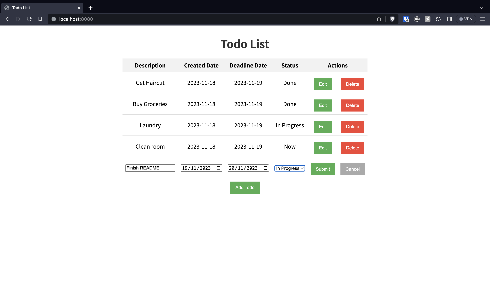

# go-htmx-todo

A TODO app built in Go and powered by htmx and sqlite.

## Usage

To use this application, follow these steps:

1. Clone the repository to your local machine.
2. Install the necessary dependencies by running `go get`.
3. Build the application by running `go build`.
4. Start the application by executing the generated binary file.
5. Open your web browser and go to `http://localhost:8080` to access the todo list.
